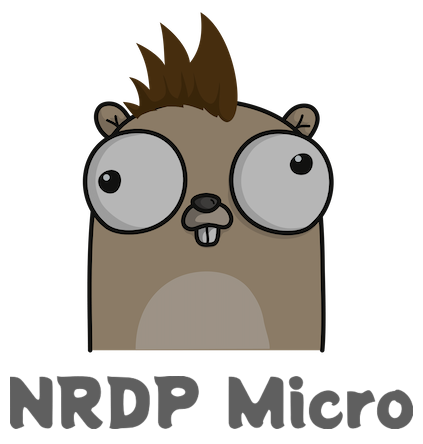

[](https://opensource.org/licenses/MIT)

A lightweight Go microservice designed to receive Nagios NRDP (Nagios Remote Data Processor) check results via HTTP POST, process them, and store them for Nagios Core consumption. It also dynamically generates Nagios host and service configuration files based on received data.

## Features

*   **NRDP Endpoint:** Listens for incoming NRDP check results via HTTP POST requests (`/`).
*   **Data Processing:** Parses XML check result data.
*   **Check Result Storage:** Writes check results to spool files in a configured directory (compatible with Nagios `check_result_path`).
*   **Status Database:** Maintains a simple SQLite database (`status.db`) to track the last seen time for hosts and services.
*   **Dynamic Nagios Configuration:** Automatically generates Nagios host and service configuration files based on the hosts/services sending data. Stale entries are periodically removed based on TTL settings.
*   **Storage Management:** Monitors disk space and manages the number of check result files.
*   **System Metrics:** Logs basic system metrics (configurable verbosity).
*   **Configurable:** Behavior controlled via a YAML configuration file.

## Installation

1.  **Prerequisites:**
    *   Go (version 1.x recommended)
    *   Git
2.  **Clone the repository:**
    ```bash
    git clone https://github.com/oceanplexian/nrdp-micro.git
    cd nrdp_micro
    ```
3.  **Build the binary:**
    ```bash
    go build -o nrdp_micro main.go
    ```
    This will create an executable file named `nrdp_micro` in the current directory.

## Configuration

The service requires a configuration file (e.g., `config.yaml`) specified at runtime using the `-config` command-line flag.

**Example `config.yaml`:**

```yaml
server:
  listen_addr: ":8080" # Address and port to listen on

storage:
  output_dir: "/var/spool/nagios/nrdp" # Directory to store check results (must match Nagios check_result_path)
  group_name: "nagios"                 # Group ownership for created files (service must run as user that can chgrp to this)
  max_files: 10000                     # Max number of check result files to keep
  min_disk_space: 500                  # Minimum free disk space in MB required to accept data

database:
  path: "/var/lib/nrdp_micro/status.db" # Path to the SQLite status database file

nagios:
  config_dir: "/etc/nagios/conf.d/nrdp_hosts" # Directory for generated Nagios configs (must exist)
  check_interval: 5                    # Default Nagios check interval (minutes) for generated services
  retry_interval: 1                    # Default Nagios retry interval (minutes) for generated services
  max_check_attempts: 3                # Default Nagios max check attempts for generated services
  check_period: "24x7"                 # Default Nagios check period for generated objects
  notification_period: "24x7"          # Default Nagios notification period for generated objects
  contacts: "nagiosadmin"              # Default contacts for generated objects
  contact_groups: "admins"             # Default contact groups for generated objects
  host_template: "linux-server"        # Default host template to use for generated hosts
  service_template: "generic-service"  # Default service template to use for generated services
  generate_interval: 60                # How often to regenerate configs (seconds)
  host_ttl: 1440                       # Host TTL in minutes (hosts unseen for this long are removed from config)
  service_ttl: 1440                    # Service TTL in minutes (services unseen for this long are removed from config)

logging:
  level: "info"      # Logging level: "debug", "info", "trace"
  verbose: false     # If true, logs detailed system metrics every second
  show_raw: false    # If true, logs the raw XMLDATA received in POST requests
```

**Important Configuration Notes:**

*   Ensure the `storage.output_dir` exists and the user running `nrdp_micro` has write permissions. If `storage.group_name` is set, the user must also have permission to change file group ownership to that group.
*   Ensure the directory for `database.path` exists and is writable by the service user.
*   Ensure the `nagios.config_dir` exists and is writable by the service user. This directory should be included in your main Nagios configuration (`nagios.cfg`).
*   Configure your Nagios instance to process external commands and check results from the `storage.output_dir`.

## Usage

Run the compiled binary, providing the path to your configuration file:

```bash
./nrdp_micro -config /path/to/your/config.yaml
```

The service will start, log its status, and begin listening for NRDP requests on the address specified in `server.listen_addr`. It will also start the background tasks for monitoring system metrics and generating Nagios configuration files.

## Project Structure

*   `main.go`: Main application entry point, HTTP handler setup, and initialization.
*   `check/`: Logic for parsing and processing NRDP check results.
*   `config/`: Configuration file loading and validation.
*   `db/`: SQLite database interaction for host/service status tracking.
*   `logger/`: Configurable logging utilities.
*   `metrics/`: System metrics collection.
*   `nagios_config/`: Dynamic Nagios configuration generation logic.
*   `storage/`: Check result file storage management and disk checks.

## Contributing

Contributions are welcome! Please feel free to submit pull requests or open issues on the project repository.

1.  Fork the repository.
2.  Create your feature branch (`git checkout -b feature/AmazingFeature`).
3.  Commit your changes (`git commit -m 'Add some AmazingFeature'`).
4.  Push to the branch (`git push origin feature/AmazingFeature`).
5.  Open a Pull Request.

## License

This project is licensed under the MIT License. See the `LICENSE` file for details (or assume standard MIT if the file is missing).
